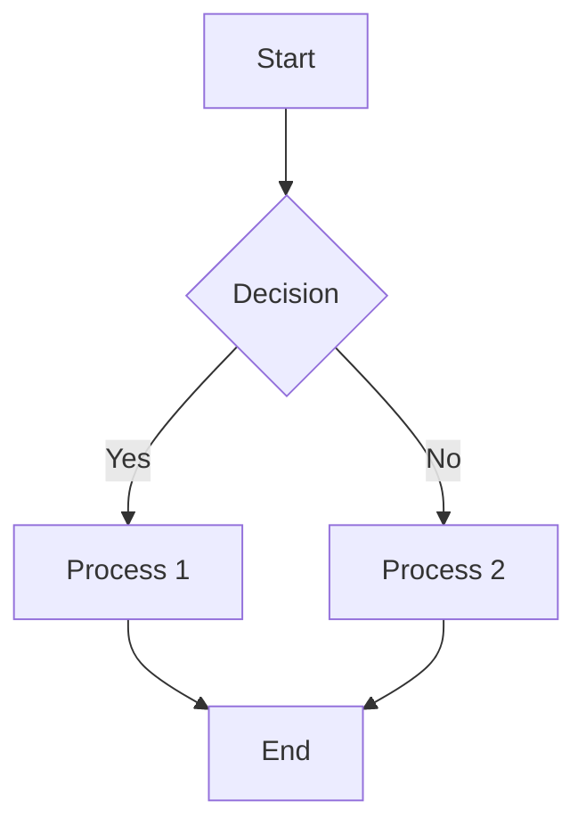
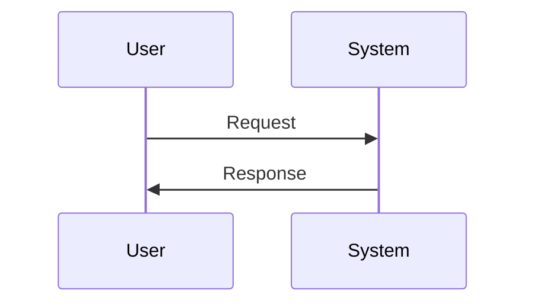

# MkDocs Project Setup Guide


## Prerequisites

Before you begin, ensure you have the following installed on your system:
- Python (version 3.6 or higher)
- pip (Python package manager, usually comes with Python)

## Step 1: installation

Install MkDocs and the Material for MkDocs theme using pip:

```bash
pip install mkdocs-material
```

## Step 2: create new project

Initialize a new MkDocs project in a folder of your choice.

```bash
mkdir my-mkdocs-site
cd my-mkdocs-site

mkdocs new .
```

Your project now has this structure:
```
my-mkdocs-site/
    ├── docs/
    │    ├── index.md
    │    └── images/
    └── mkdocs.yml
```

## Step 3: configuration (`mkdocs.yml`)

Replace the contents of `mkdocs.yml` with this configuration:

```yaml
site_name: My MkDocs Site
site_description: A modern documentation website built with MkDocs
site_author: Your Name

theme:
  name: material
  features:
    - navigation.tabs
    - navigation.sections
    - toc.integrate
    - search.suggest
    - search.highlight
    - content.tabs.link
    - content.code.annotate
  palette:
    primary: indigo
    accent: deep orange

extra_css:
  - stylesheets/extra.css

plugins:
  - search

markdown_extensions:
  - admonition
  - pymdownx.details
  - pymdownx.superfences
  - pymdownx.highlight
  - pymdownx.inlinehilite
  - pymdownx.tabbed:
      alternate_style: true
  - attr_list
  - tables

nav:
  - Home: index.md
  - Guide: guide.md
  - About: about.md
```

## Step 4: custom styling

Create custom CSS file:

```bash
mkdir docs/stylesheets
touch docs/stylesheets/extra.css
```

## Step 5: serve your site locally

Run from your project's root directory:

```bash
mkdocs serve
```

Your site will be available at `http://127.0.0.1:8000`.

## Step 6: content creation

### Basic formatting

**Bold** and *italic* text:

```markdown
**Bold text**
*Italic text*
```

### Lists

**Numbered list:**

```markdown
1. First item.
2. Second item.
3. Third item.
   1. Indented item.
   2. Another indented item.
```

**Bullet list:**

```markdown
- First item.
- Second item.
- Third item.
  - Nested item.
  - Another nested item.
```

### Tables

**Basic table:**

| Header 1 | Header 2 | Header 3 |
|----------|----------|----------|
| Cell 1   | Cell 2   | Cell 3   |
| Row 2    | Data     | Info     |


**Alignment in table:**

| Left-aligned | Center-aligned | Right-aligned |
|:-------------|:--------------:|--------------:|
| Data         | Data           | Data          |


### Multiple Images

**Multiple images in a row:**

<p align="center">
  
   
  
</p>

### Mermaid Diagrams

**Flowchart:**



**Sequence diagram:**



### LaTeX math equations

**Inline math:**

The Pythagorean theorem is $a^2 + b^2 = c^2$.


**Block equations:**

$$
\int_{-\infty}^{\infty} e^{-x^2} dx = \sqrt{\pi}
$$


**Equation with alignment:**

$$
\begin{align}
y &= x^2 \\
z &= \sqrt{y}
\end{align}
$$

### Images


### Tabs

=== "Tab 1"
    Content for the first tab.

=== "Tab 2"
    Content for the second tab.


### Hints

!!! note
    This is a neutral note.

!!! abstract "Custom Title"
    This is a summary with a custom title.

!!! success
    This indicates a successful action.

!!! warning
    This is a warning.

!!! danger
    This is a dangerous thing.


### Links

[Link Text](guide.md)
[Link to header](guide.md#specific-header)

[Cat](https://en.wikipedia.org/wiki/Cat)

<a href="https://en.wikipedia.org/wiki/Cat" target="_blank">Cat</a>


### Code Blocks

```python
def hello_world():
    print("Hello, World!")
```

```python title="hello.py"
def hello_world():
    print("Hello, World!")
```


## Step 7: build and deploy

```bash
mkdocs build

mkdocs gh-deploy
```