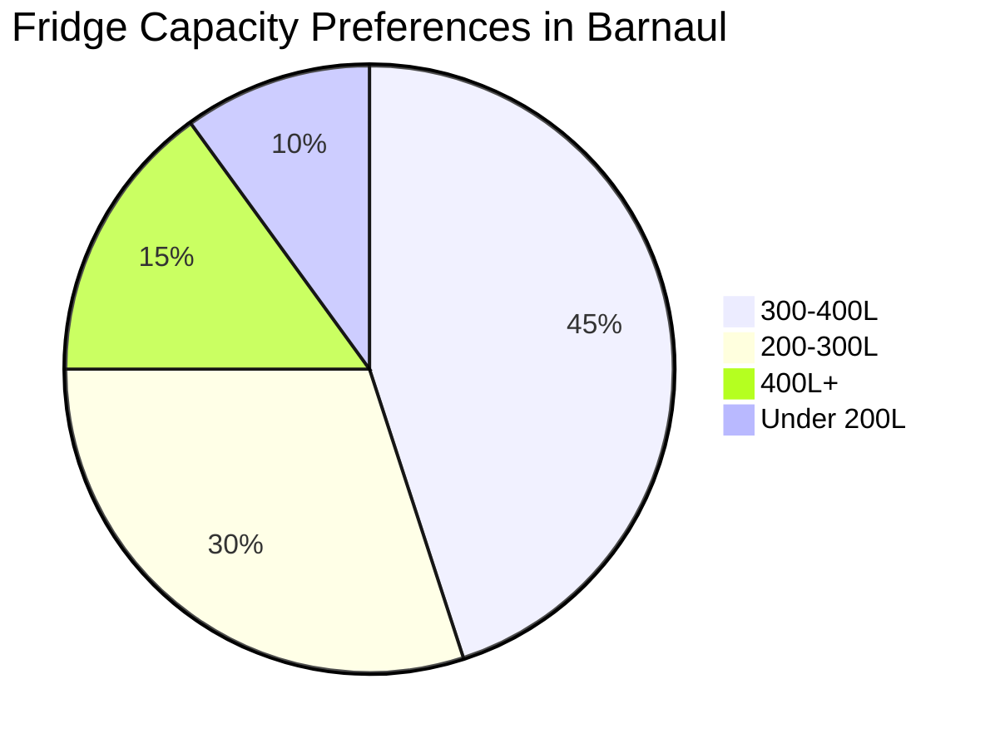

# Refrigerator Buying Guide: Overview

## Key Considerations

!!! note "Important"
    Consider your family size, kitchen space, and budget before choosing.

### Essential Features

- **Capacity**: Measured in liters (200-400L for families).

- **Energy Efficiency**: Class A+++ is most efficient.

- **Noise Level**: Below 40 dB is quiet.

- **Climate Class**: N-ST for Barnaul's climate.

### Popular Capacity Choices

