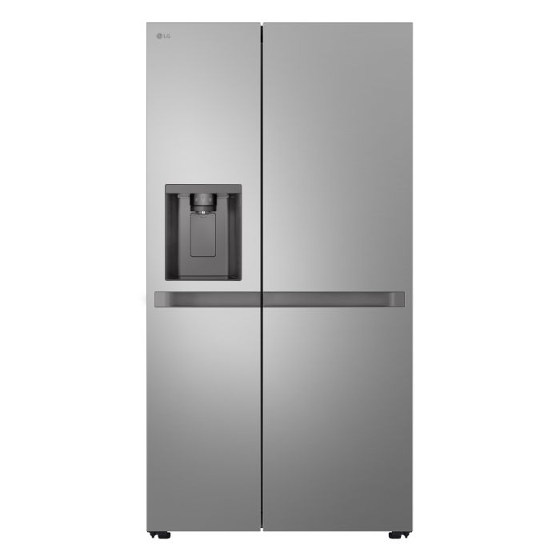

# Welcome to Barnaul Refrigerator Guide! ❄️

Your comprehensive guide to choosing the perfect refrigerator in Barnaul. We provide expert reviews, price comparisons, and practical advice to help you make the best decision.

!!! success "Quick Tip"
    The average refrigerator in Barnaul lasts 10-15 years, so choose wisely!

## What You'll Find Here:

- 🏷️ **Buying Guide** - Detailed comparisons and recommendations

- 🏪 **Store Reviews** - Where to buy in Barnaul

- 💰 **Price Comparison** - Best deals and discounts

- 🔧 **Maintenance** - Installation and care tips

=== "First-time Buyer"
    Start with our [comprehensive guide](guide/overview.md) to understand key features

=== "Replacing Old Unit"
    Check [current models](guide/types.md) and [local prices](stores/prices.md)

=== "Specific Needs"
    Compare [different types](guide/types.md) and [brands](guide/brands.md)

---

> *"A good refrigerator is not an expense, but an investment in your family's health and comfort"* - Local Appliance Expert