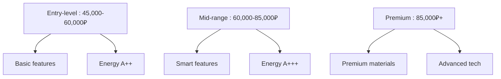

# Price Comparison: Barnaul Market

## Current Market Prices

!!! success "Best Time to Buy"
    Prices are lowest during seasonal sales (November-January, May-July).

## Price Ranges by Type

### Single Door Refrigerators

**Budget Range**: 12,000-18,000₽.

- Brands: Biryusa, Nord.

- Features: Basic, manual defrost.

- Energy: B to A+.

**Mid-Range**: 18,000-25,000₽.  

- Brands: Indesit, Ariston.

- Features: No-Frost, better insulation.

- Energy: A+ to A++.

### French Door Models

